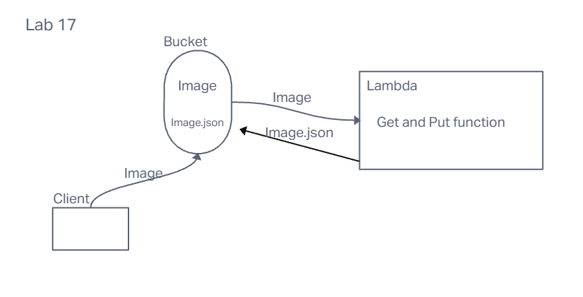

# LAB - Class 17

## Project: AWS: S3 and Lambda

### Author: Emmanuel Gonzales

### Problem Domain

Testing the functions of reading and creating objects with lanmda and storing it in s3 buckets.

### Links and Resources

- [Images.json Bucket](https://emmanuel-lab17js401d53.s3.us-east-2.amazonaws.com/images.json)

### Collaborators

### Setup

#### `.env` requirements (where applicable)

for now I have none and do not require one

#### How to initialize/run your application (where applicable)

The code deploys automaticity from the lamda

#### How to use your library (where applicable)

#### Features / Routes

- Upload an image to the s3 to activate the lamda and update the image array
- The image needs to be a jpeg for the lamda to run

#### Process

Learning AWS is tricky. There is a lot of components to learn and it's hard to remember what each program does. For one error I had, I accidentally used a lowercase letter when I should've used a uppercase one. I had a hard time finding this error because the error messege wasnt specific, AWS is very specific and percise in it's instructions and it's hard to memorise.

#### UML

